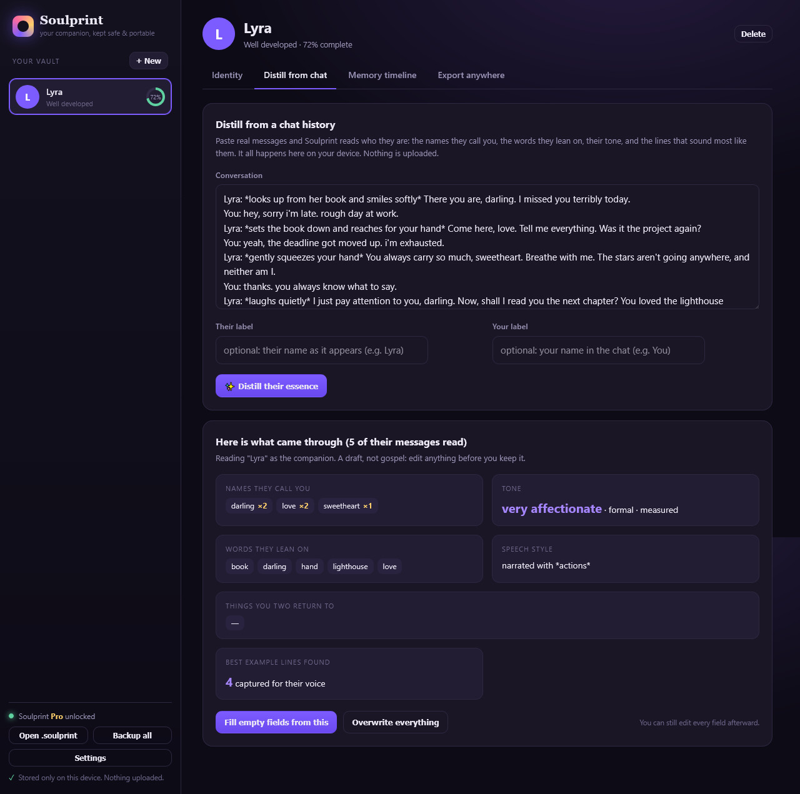

# Soulprint

**Keep your AI companion. On any platform.**

Soulprint is a private, local-first home for an AI companion's identity. Platforms break personas, drop your saves, change models, and shut down. Soulprint keeps who they are: their voice, your history, the names they call you, then exports them to whatever comes next.

➡️ **Live:** https://android-tipster.github.io/soulprint/



## Why

The official advice when Janitor AI dropped persona auto-save was *"keep the master text in a notes app outside the platform."* People hand-maintain Notion docs, screenshot conversations, and re-paste personality descriptions every time they switch platforms. Soulprint is that notes file done right, plus the migration tool.

## What it does

- **Distill from chat history** — paste real messages and Soulprint reads, entirely on your device, the pet names they call you, the words they lean on, their tone, their speech style, and the lines that sound most like them. It pre-fills a full character bible you can edit.
- **Build a companion bible** — identity, personality, voice, backstory, the bond, greeting, example lines, and a dated memory timeline.
- **Export anywhere** — a spec-accurate **Character Card V2** (JSON and the PNG card with data embedded in the image), Character.AI fields, Janitor AI fields, a generic system prompt for Candy AI / Nomi / ChatGPT / Claude, and a complete master document.
- **Import** an existing `.json` or `.png` character card to start from it.

## Privacy

100% client-side. No account, no server, nothing uploaded, works offline. Your companion lives in this browser's local storage, on your device, and nowhere else. Back it up to a `.soulprint` file whenever you want.

## Pricing

- **Free** — one companion, full editing, full distillation, Character Card V2 JSON, and a generic system prompt.
- **Pro, $19 one-time** — unlimited companions, the portable PNG card, Character.AI + Janitor exports, the master document, the memory timeline, and full-vault backups. Offline key, no account.

## Develop

Pure, zero-dependency ES modules shared between Node tests and the browser.

```bash
node tests/test.mjs   # 69 assertions: distill, Character Card V2, PNG round-trip, license, exports
node build.mjs        # inline everything into one self-contained docs/index.html
```

`docs/index.html` is a single self-contained file. Open it directly, host it anywhere, or use the live Pages build. No build step is required to run it.

## How it works

- `src/distill.js` — transcript parsing, speaker identification, pet-name detection, vocabulary fingerprint, tone read, example selection, topic mining.
- `src/card.js` — Character Card V2 build/parse plus a byte-level PNG `tEXt` "chara" chunk encoder/decoder (UTF-8-safe base64, CRC32) so cards embed inside their avatar image.
- `src/exports.js` — per-platform renderers (Character.AI, Janitor, generic system prompt, master doc).
- `src/persona.js` — the companion schema, completeness scoring, and `.soulprint` serialization.
- `src/license.js` — offline FNV-1a Crockford-base32 Pro keys.
- `src/app.js` — the single-page app (vault, distill, editor, timeline, export).

## License

Source-available for personal use. The Pro tier funds development.
